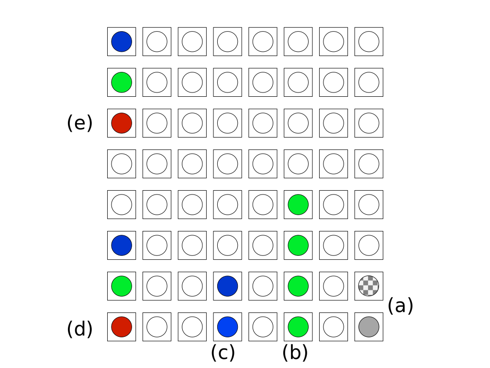

# berrymon

## Usage
````
usage: berrymon.py [-h] [-s] [--sensehat_required] [-i]
                   [--ifttt_period IFTTT_PERIOD] [-p PERIOD]
                   [--min_temp MIN_TEMP] [--max_temp MAX_TEMP]
                   [--min_freq MIN_FREQ] [--max_freq MAX_FREQ]
                   [--led_rotation LED_ROTATION] [--power_management]
                   [--log LOG] [--log_days LOG_DAYS] [--log_period LOG_PERIOD]

Monitor Logger

optional arguments:
  -h, --help            show this help message and exit
  -s, --sensehat        enables the Sense HAT LEDs, optionally (default:
                        False)
  --sensehat_required   fails if the Sense HAT LED cannot be loaded (requires
                        --sensehat also) (default: False)
  -i, --ifttt           posts metrics to IFTTT using the key stored in env var
                        IFTTT_TOKEN (default: False)
  --ifttt_period IFTTT_PERIOD
                        send an IFTTT post every N executions (default: 1)
  -p PERIOD, --period PERIOD
                        seconds to sleep between monitoring (default: 1)
  --min_temp MIN_TEMP   Min bar graph temperature (default: 40)
  --max_temp MAX_TEMP   Max bar graph temperature (default: 80)
  --min_freq MIN_FREQ   Min bar graph frequency (default: 600000000)
  --max_freq MAX_FREQ   Max bar graph frequency (default: 1400000000)
  --led_rotation LED_ROTATION
                        rotation of the Sense HAT LEDs (90deg increments)
                        (default: 0)
  --power_management    allows joystick power control (middle=sudo shutdown,
                        others=sudo reboot) (default: False)
  --log LOG             path to log to (default: None)
  --log_days LOG_DAYS   days of logs to keep (default: 7)
  --log_period LOG_PERIOD
                        print/log every N executions (default: 1)
````

## Sense HAT display



Includes:

* (a) Alternate blinking light to indicate monlog is running.  Also provides a reference point for the bottom-right and orientation.
* (b) Bar graph of SoC temperature (default: 40C to 80C)
* (c) Bar graph of arm core frequency (default: 600MHz to 1400MHz)
* (d) Current throttling status: bottom/red - undervoltage; middle/green - frequency capped; blue/top - throttled  
* (e) Past throttling status (see (d) for colors)

## Running as a daemon


## License Notice
See [LICENSE](LICENSE).

````
berrymon - Tools for monitoring a single board computer

WARNING: You are responsible for following all relevant safety
precautions and using your device responsibly. You must independently
assess whether any advice or recommendations contained in this
software (including all documentation) is suitable and safe for you and
your device.

Copyright (c) 2018 by Advay Mengle - https://github.com/madvay/berrymon

Licensed under the Apache License, Version 2.0 (the "License");
you may not use this software except in compliance with the License.
You may obtain a copy of the License at

   http://www.apache.org/licenses/LICENSE-2.0

Unless required by applicable law or agreed to in writing, software
distributed under the License is distributed on an "AS IS" BASIS,
WITHOUT WARRANTIES OR CONDITIONS OF ANY KIND, either express or implied.
See the License for the specific language governing permissions and
limitations under the License.

This serves as the NOTICE under Section 4 d of the License.
````
